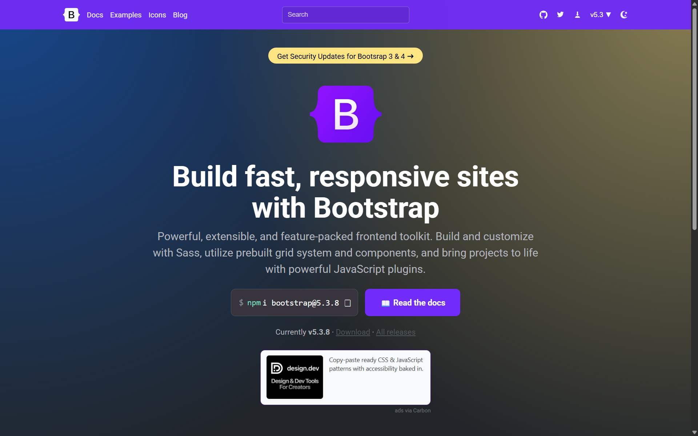

# Bootstrap Landing Page Recreation

A front-end practice project recreating the visual appearance of the Bootstrap homepage using only native HTML and CSS.

This project was created as a learning exercise to understand how modern landing pages are structured and styled without relying on CSS frameworks or JavaScript libraries.

## Preview

## About The Project

This project is a recreation of the Bootstrap homepage, focusing on the main sections visible on the upper and middle parts of the original website.

The goal was not to copy Bootstrap's source code or build the Bootstrap framework itself, but to practice translating an existing website interface into a functional webpage using native HTML and CSS.

Through this project, I practiced:

* Structuring webpages with semantic HTML
* Creating layouts using CSS
* Working with Flexbox
* Working with CSS spacing and positioning
* Creating responsive layouts
* Reproducing typography and visual hierarchy
* Organizing front-end project files
* Improving attention to UI details

## Built With

* HTML5
* CSS3

No CSS framework or JavaScript library was used to build the interface.

## Features

* Bootstrap-inspired landing page
* Responsive layout
* Navigation bar
* Hero section
* Content sections
* Call-to-action elements
* Footer / lower sections included according to the project scope
* Pure HTML and CSS implementation

## What I Learned

Building this project helped me understand that recreating a professional interface requires more than writing HTML elements and adding basic CSS.

I learned how different layout techniques work together, particularly Flexbox, spacing, typography, positioning, and responsive design.

This project also helped me become more comfortable with writing CSS from scratch instead of relying on pre-built components from a framework.

## Disclaimer

This project is an educational recreation inspired by the Bootstrap website.

Bootstrap and its website design are trademarks and/or intellectual property of their respective owners. This project is not affiliated with, endorsed by, or officially associated with Bootstrap.

The purpose of this project is solely for learning and portfolio development.

## Original Reference

The original interface was referenced from the official Bootstrap website.

## Author

**Lingga**

Informatics Engineering Student

Interested in:

* Data Analytics
* Data Science
* Data Engineering
* Front-End Development

---

⭐ This project was created as part of my journey to strengthen my programming and software development fundamentals.
